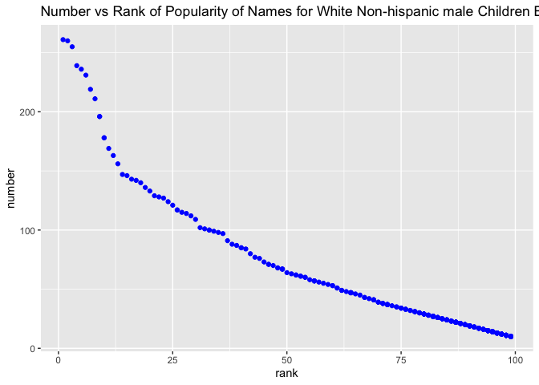

p8105\_hw2\_yw3774.Rmd
================
Yida Wang
10/1/2021

``` r
library(tidyverse)
```

    ## ── Attaching packages ─────────────────────────────────────── tidyverse 1.3.1 ──

    ## ✓ ggplot2 3.3.5     ✓ purrr   0.3.4
    ## ✓ tibble  3.1.4     ✓ dplyr   1.0.7
    ## ✓ tidyr   1.1.3     ✓ stringr 1.4.0
    ## ✓ readr   2.0.1     ✓ forcats 0.5.1

    ## ── Conflicts ────────────────────────────────────────── tidyverse_conflicts() ──
    ## x dplyr::filter() masks stats::filter()
    ## x dplyr::lag()    masks stats::lag()

``` r
library(readxl)
library(ggplot2)
```

## problem 1

Read and clean the Mr. Trash Wheel sheet:  
\* specify the sheet in the Excel file and to omit non-data entries
(rows with notes / figures; columns containing notes) using arguments in
read\_excel  
\* use reasonable variable names  
\* omit rows that do not include dumpster-specific data  
\* round the number of sports balls to the nearest integer

``` r
trash_wheel_df = 
  read_excel("./data/Trash-Wheel-New.xlsx", sheet = "Mr. Trash Wheel", range = cell_cols ("A2:N534")) %>%
  janitor::clean_names() %>% 
  drop_na(dumpster) %>% 
  mutate(sports_balls = round(sports_balls))
```

    ## New names:
    ## * `` -> ...15
    ## * `` -> ...16
    ## * `` -> ...17

``` r
trash_wheel_df
```

    ## # A tibble: 454 × 17
    ##    dumpster month  year date                weight_tons volume_cubic_yards
    ##    <chr>    <chr> <dbl> <dttm>                    <dbl>              <dbl>
    ##  1 1        May    2014 2014-05-16 00:00:00        4.31                 18
    ##  2 2        May    2014 2014-05-16 00:00:00        2.74                 13
    ##  3 3        May    2014 2014-05-16 00:00:00        3.45                 15
    ##  4 4        May    2014 2014-05-17 00:00:00        3.1                  15
    ##  5 5        May    2014 2014-05-17 00:00:00        4.06                 18
    ##  6 6        May    2014 2014-05-20 00:00:00        2.71                 13
    ##  7 7        May    2014 2014-05-21 00:00:00        1.91                  8
    ##  8 8        May    2014 2014-05-28 00:00:00        3.7                  16
    ##  9 9        June   2014 2014-06-05 00:00:00        2.52                 14
    ## 10 10       June   2014 2014-06-11 00:00:00        3.76                 18
    ## # … with 444 more rows, and 11 more variables: plastic_bottles <dbl>,
    ## #   polystyrene <dbl>, cigarette_butts <dbl>, glass_bottles <dbl>,
    ## #   grocery_bags <dbl>, chip_bags <dbl>, sports_balls <dbl>,
    ## #   homes_powered <dbl>, x15 <chr>, x16 <lgl>, x17 <lgl>

Read and clean precipitation data for 2018 and 2019. For each, omit rows
without precipitation data and add a variable for year.

``` r
prec_2018 = 
  read_excel("./data/Trash-Wheel-New.xlsx", sheet = "2018 Precipitation", range = "A2:B14") %>%
  janitor::clean_names() %>% 
  mutate(year = "2018")
prec_2018
```

    ## # A tibble: 12 × 3
    ##    month total year 
    ##    <dbl> <dbl> <chr>
    ##  1     1  0.94 2018 
    ##  2     2  4.8  2018 
    ##  3     3  2.69 2018 
    ##  4     4  4.69 2018 
    ##  5     5  9.27 2018 
    ##  6     6  4.77 2018 
    ##  7     7 10.2  2018 
    ##  8     8  6.45 2018 
    ##  9     9 10.5  2018 
    ## 10    10  2.12 2018 
    ## 11    11  7.82 2018 
    ## 12    12  6.11 2018

``` r
prec_2019 = 
  read_excel("./data/Trash-Wheel-New.xlsx", sheet = "2019 Precipitation", range = "A2:B14") %>% 
  janitor::clean_names() %>% 
  mutate(year = "2019")
prec_2019
```

    ## # A tibble: 12 × 3
    ##    month total year 
    ##    <dbl> <dbl> <chr>
    ##  1     1  3.1  2019 
    ##  2     2  3.64 2019 
    ##  3     3  4.47 2019 
    ##  4     4  1.46 2019 
    ##  5     5  3.58 2019 
    ##  6     6  0.42 2019 
    ##  7     7  3.85 2019 
    ##  8     8  2.39 2019 
    ##  9     9  0.16 2019 
    ## 10    10  5.45 2019 
    ## 11    11  1.86 2019 
    ## 12    12  3.57 2019

Next, combine precipitation datasets and convert month to a character
variable (the variable month.name is built into R and should be useful).

``` r
prec_df = 
  bind_rows(prec_2018,prec_2019) %>% 
  mutate(month = month.name[month]) %>% 
  relocate(year)
prec_df
```

    ## # A tibble: 24 × 3
    ##    year  month     total
    ##    <chr> <chr>     <dbl>
    ##  1 2018  January    0.94
    ##  2 2018  February   4.8 
    ##  3 2018  March      2.69
    ##  4 2018  April      4.69
    ##  5 2018  May        9.27
    ##  6 2018  June       4.77
    ##  7 2018  July      10.2 
    ##  8 2018  August     6.45
    ##  9 2018  September 10.5 
    ## 10 2018  October    2.12
    ## # … with 14 more rows

Write a paragraph about these data; you are encouraged to use inline R.
Be sure to note the number of observations in both resulting datasets,
and give examples of key variables. For available data, what was the
total precipitation in 2018? What was the median number of sports balls
in a dumpster in 2019?

-   The Mr.Trash Wheel dataset  
    The Mr.Trash Wheel dataset contains litter data for **total of 454
    dumpsters** **through 9 years**. It has **17 variables** in this
    dataset, which is chip\_bags, cigarette\_butts, date, dumpster,
    glass\_bottles, grocery\_bags, homes\_powered, month,
    plastic\_bottles, polystyrene, sports\_balls, volume\_cubic\_yards,
    weight\_tons, x15, x16, x17, year.

-   prec\_2018 & prec\_2019 dataset  
    The **number of observation** is 12 for the 2018 precipitation data
    and 12 for the 2019 data. Both datasets have 3 variables, including
    month, year, and precipitation amount in inches. The **total amount
    of precipitation** in 2018 was 70.33 inches and **the average
    amount** was 5.8608333 inches. The total amount of precipitation in
    2019 (data for 12 months) was 33.95 inches and the median was 3.335
    inches.

-   prec\_df dataset  
    The conmbined dataset contains precipitation data for both 2018
    and 2019. The **total amount of precipitation** was 104.28 and **the
    average** was 4.345.

## Problem 2

This problem uses the FiveThirtyEight data; these data were gathered to
create the interactive graphic on this page. In particular, we’ll use
the data in pols-month.csv, unemployment.csv, and snp.csv. Our goal is
to merge these into a single data frame using year and month as keys
across datasets.

First, clean the data in pols-month.csv. Use separate() to break up the
variable mon into integer variables year, month, and day; replace month
number with month name; create a president variable taking values gop
and dem, and remove prez\_dem and prez\_gop; and remove the day
variable.

``` r
pols_month =
  read_csv("./data/fivethirtyeight_datasets/pols-month.csv") %>% 
  separate(mon, into = c("year", "month","day")) %>% 
  mutate(
    year = as.integer(year),
    month = as.integer(month),
    day = as.integer(day)
  ) %>% 
  mutate(month = month.name[month]) %>% 
  mutate(year = as.character(year)) %>%
  mutate(president = ifelse(prez_gop == 1 | prez_gop == 2, "gop", "dem")) %>% 
  select(-prez_dem,-prez_gop,-day)
```

    ## Rows: 822 Columns: 9

    ## ── Column specification ────────────────────────────────────────────────────────
    ## Delimiter: ","
    ## dbl  (8): prez_gop, gov_gop, sen_gop, rep_gop, prez_dem, gov_dem, sen_dem, r...
    ## date (1): mon

    ## 
    ## ℹ Use `spec()` to retrieve the full column specification for this data.
    ## ℹ Specify the column types or set `show_col_types = FALSE` to quiet this message.

``` r
pols_month
```

    ## # A tibble: 822 × 9
    ##    year  month     gov_gop sen_gop rep_gop gov_dem sen_dem rep_dem president
    ##    <chr> <chr>       <dbl>   <dbl>   <dbl>   <dbl>   <dbl>   <dbl> <chr>    
    ##  1 1947  January        23      51     253      23      45     198 dem      
    ##  2 1947  February       23      51     253      23      45     198 dem      
    ##  3 1947  March          23      51     253      23      45     198 dem      
    ##  4 1947  April          23      51     253      23      45     198 dem      
    ##  5 1947  May            23      51     253      23      45     198 dem      
    ##  6 1947  June           23      51     253      23      45     198 dem      
    ##  7 1947  July           23      51     253      23      45     198 dem      
    ##  8 1947  August         23      51     253      23      45     198 dem      
    ##  9 1947  September      23      51     253      23      45     198 dem      
    ## 10 1947  October        23      51     253      23      45     198 dem      
    ## # … with 812 more rows

Second, clean the data in snp.csv using a similar process to the above.
For consistency across datasets, arrange according to year and month,
and organize so that year and month are the leading columns.

``` r
snp_df = read_csv("./data/fivethirtyeight_datasets/snp.csv") %>%
  separate(date, into = c("month", "day", "year"), sep = "/") %>%
  mutate(year = as.numeric(year) + 2000) %>%
  mutate(year = ifelse(year >= "2050", year - 100, year)) %>% 
  mutate(month = as.numeric(month)) %>% 
  arrange(year,month) %>% 
  mutate(month = month.name[month]) %>% 
  mutate(year = as.character(year)) %>%
  relocate(year,month) %>% 
  select(-day)
```

    ## Rows: 787 Columns: 2

    ## ── Column specification ────────────────────────────────────────────────────────
    ## Delimiter: ","
    ## chr (1): date
    ## dbl (1): close

    ## 
    ## ℹ Use `spec()` to retrieve the full column specification for this data.
    ## ℹ Specify the column types or set `show_col_types = FALSE` to quiet this message.

``` r
snp_df
```

    ## # A tibble: 787 × 3
    ##    year  month     close
    ##    <chr> <chr>     <dbl>
    ##  1 1950  January    17.0
    ##  2 1950  February   17.2
    ##  3 1950  March      17.3
    ##  4 1950  April      18.0
    ##  5 1950  May        18.8
    ##  6 1950  June       17.7
    ##  7 1950  July       17.8
    ##  8 1950  August     18.4
    ##  9 1950  September  19.5
    ## 10 1950  October    19.5
    ## # … with 777 more rows

Third, tidy the unemployment data so that it can be merged with the
previous datasets. This process will involve switching from “wide” to
“long” format; ensuring that key variables have the same name; and
ensuring that key variables take the same values.

``` r
unemp_df = 
  read_csv("./data/fivethirtyeight_datasets/unemployment.csv") %>% 
  pivot_longer(
    Jan:Dec,
    names_to = "month",
    values_to = "unemployment") %>% 
  mutate(month = match(month,month.abb)) %>% 
  mutate(month = month.name[month]) %>% 
  janitor::clean_names() %>%
  mutate(year = as.character(year))
```

    ## Rows: 68 Columns: 13

    ## ── Column specification ────────────────────────────────────────────────────────
    ## Delimiter: ","
    ## dbl (13): Year, Jan, Feb, Mar, Apr, May, Jun, Jul, Aug, Sep, Oct, Nov, Dec

    ## 
    ## ℹ Use `spec()` to retrieve the full column specification for this data.
    ## ℹ Specify the column types or set `show_col_types = FALSE` to quiet this message.

``` r
unemp_df
```

    ## # A tibble: 816 × 3
    ##    year  month     unemployment
    ##    <chr> <chr>            <dbl>
    ##  1 1948  January            3.4
    ##  2 1948  February           3.8
    ##  3 1948  March              4  
    ##  4 1948  April              3.9
    ##  5 1948  May                3.5
    ##  6 1948  June               3.6
    ##  7 1948  July               3.6
    ##  8 1948  August             3.9
    ##  9 1948  September          3.8
    ## 10 1948  October            3.7
    ## # … with 806 more rows

Join the datasets by merging snp into pols, and merging unemployment
into the result. (Merge snp\_df to pols\_month and then merge unemp\_df
into the merged data using `left_join`)

``` r
pols_snp_df = left_join(pols_month, snp_df, by = c("year", "month"))
pols_snp_unemp_df = left_join(pols_snp_df, unemp_df, by = c("year", "month"))
pols_snp_unemp_df
```

    ## # A tibble: 822 × 11
    ##    year  month   gov_gop sen_gop rep_gop gov_dem sen_dem rep_dem president close
    ##    <chr> <chr>     <dbl>   <dbl>   <dbl>   <dbl>   <dbl>   <dbl> <chr>     <dbl>
    ##  1 1947  January      23      51     253      23      45     198 dem          NA
    ##  2 1947  Februa…      23      51     253      23      45     198 dem          NA
    ##  3 1947  March        23      51     253      23      45     198 dem          NA
    ##  4 1947  April        23      51     253      23      45     198 dem          NA
    ##  5 1947  May          23      51     253      23      45     198 dem          NA
    ##  6 1947  June         23      51     253      23      45     198 dem          NA
    ##  7 1947  July         23      51     253      23      45     198 dem          NA
    ##  8 1947  August       23      51     253      23      45     198 dem          NA
    ##  9 1947  Septem…      23      51     253      23      45     198 dem          NA
    ## 10 1947  October      23      51     253      23      45     198 dem          NA
    ## # … with 812 more rows, and 1 more variable: unemployment <dbl>

Write a short paragraph about these datasets. Explain briefly what each
dataset contained, and describe the resulting dataset (e.g. give the
dimension, range of years, and names of key variables).

-   pols\_month dataset  
    The **dimension of observations** in pols\_month dataset is 822 and
    9.  
    The **year range** in national politicians who are democratic or
    republican is from 2015 to 1947 years. The **key variables** include
    the number of republican senators, governors, representatives, and
    president,as well as the number of democratic senators, governors,
    representatives, and president at each year and month.

-   snp\_df dataset The **dimension of observations** in snp dataset is
    787 and 3. The **year range** is65 years from 1950 to 2015. The
    **key variable** in this dataset is close which specifies the
    closing values of the S&P stock index on the associated date
    (year-month). The average closing value is 474.8887404.

-   unemp\_df dataset The **dimension of observations** in unemployment
    dataset is 816 and 3. The **year range** is67 years from 1948 to
    2015. The **key variable** in this dataset is unemployment which
    specifies the percentage of unemployment on associated data
    (year-month). The average unemployment rate is 5.83%. The highest
    unemployment rate is 10.8% and the lowest is 2.5%.

-   pols\_snp\_unemp\_df dataset

It is a merged dataframe from the three datasets above and the keys to
merge the set are year and month. The **dimension of observations** in
this dataset is 822 and 11. The **year range** is same as pols\_month
dataset. The **key variable** in this dataset is the conbination of the
previous variables in pols\_month with closing market index and
unemployment rate with the associated date from the pols\_month data.

## Problem 3

Load and tidy the data. Note that, although these data may seem fairly
well formatted initially, the names of a categorical predictor and the
case structure of string variables changed over time; you’ll need to
address this in your data cleaning. Also, some rows seem duplicated, and
these will need to be removed (hint: google something like “dplyr remove
duplicate rows” to get started).

``` r
popbb_names = 
   read_csv("./data/Popular_Baby_Names.csv") %>% 
   janitor::clean_names() %>% 
   mutate(ethnicity = gsub(" ", "_", ethnicity)) %>% 
   mutate(gender = tolower(gender), 
          ethnicity = tolower(ethnicity),
          childs_first_name = tolower(childs_first_name),
          childs_first_name = str_to_title(childs_first_name)) %>% 
   mutate(ethnicity = recode(ethnicity, "asian_and_pacific_islander" = "asian_and_paci", "white_non_hispanic" = "white_non_hisp", "black_non_hispanic" = "black_non_hisp")) %>%
  distinct()
```

    ## Rows: 19418 Columns: 6

    ## ── Column specification ────────────────────────────────────────────────────────
    ## Delimiter: ","
    ## chr (3): Gender, Ethnicity, Child's First Name
    ## dbl (3): Year of Birth, Count, Rank

    ## 
    ## ℹ Use `spec()` to retrieve the full column specification for this data.
    ## ℹ Specify the column types or set `show_col_types = FALSE` to quiet this message.

``` r
popbb_names
```

    ## # A tibble: 12,181 × 6
    ##    year_of_birth gender ethnicity      childs_first_name count  rank
    ##            <dbl> <chr>  <chr>          <chr>             <dbl> <dbl>
    ##  1          2016 female asian_and_paci Olivia              172     1
    ##  2          2016 female asian_and_paci Chloe               112     2
    ##  3          2016 female asian_and_paci Sophia              104     3
    ##  4          2016 female asian_and_paci Emily                99     4
    ##  5          2016 female asian_and_paci Emma                 99     4
    ##  6          2016 female asian_and_paci Mia                  79     5
    ##  7          2016 female asian_and_paci Charlotte            59     6
    ##  8          2016 female asian_and_paci Sarah                57     7
    ##  9          2016 female asian_and_paci Isabella             56     8
    ## 10          2016 female asian_and_paci Hannah               56     8
    ## # … with 12,171 more rows

Produce a well-structured, reader-friendly table showing the rank in
popularity of the name “Olivia” as a female baby name over time; this
should have rows for ethnicities and columns for year.

``` r
Olivia_df = 
  filter(popbb_names, childs_first_name == "Olivia") %>% 
  filter(gender == "female") %>% 
  select(year_of_birth, ethnicity, rank) %>% 
  arrange(ethnicity, year_of_birth)

Olivia_df
```

    ## # A tibble: 24 × 3
    ##    year_of_birth ethnicity       rank
    ##            <dbl> <chr>          <dbl>
    ##  1          2011 asian_and_paci     4
    ##  2          2012 asian_and_paci     3
    ##  3          2013 asian_and_paci     3
    ##  4          2014 asian_and_paci     1
    ##  5          2015 asian_and_paci     1
    ##  6          2016 asian_and_paci     1
    ##  7          2011 black_non_hisp    10
    ##  8          2012 black_non_hisp     8
    ##  9          2013 black_non_hisp     6
    ## 10          2014 black_non_hisp     8
    ## # … with 14 more rows

Produce a similar table showing the most popular name among male
children over time.

``` r
popmale_names = 
  filter(popbb_names, gender == "male", rank == "1") %>% 
  select(year_of_birth, ethnicity, childs_first_name) %>% 
  arrange(ethnicity, year_of_birth) %>% 
  rename(most_popmalebb_name = childs_first_name)

popmale_names
```

    ## # A tibble: 24 × 3
    ##    year_of_birth ethnicity      most_popmalebb_name
    ##            <dbl> <chr>          <chr>              
    ##  1          2011 asian_and_paci Ethan              
    ##  2          2012 asian_and_paci Ryan               
    ##  3          2013 asian_and_paci Jayden             
    ##  4          2014 asian_and_paci Jayden             
    ##  5          2015 asian_and_paci Jayden             
    ##  6          2016 asian_and_paci Ethan              
    ##  7          2011 black_non_hisp Jayden             
    ##  8          2012 black_non_hisp Jayden             
    ##  9          2013 black_non_hisp Ethan              
    ## 10          2014 black_non_hisp Ethan              
    ## # … with 14 more rows

Finally, for male, white non-hispanic children born in 2016, produce a
scatter plot showing the number of children with a name (y axis) against
the rank in popularity of that name (x axis).

``` r
scatter_df =  
  filter(popbb_names, year_of_birth == "2016", gender == "male", ethnicity == "white_non_hisp") 

df_plot = ggplot(scatter_df, aes(x = rank, y = count)) + 
  geom_point(color = 'blue') +
  labs(title = "Number vs Rank of Popularity of Names for White Non-hispanic male Children Born in 2016",
       x = "rank",
       y = "number")

df_plot
```

<!-- -->

``` r
ggsave("scatterplot.pdf")
```

    ## Saving 7 x 5 in image
